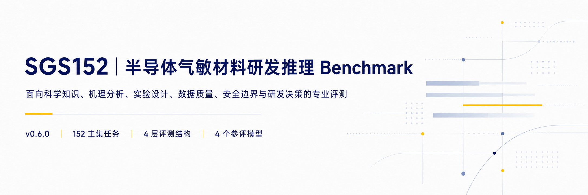

<p align="center">
  
</p>

## 项目概览

材料研发场景中的模型回答质量很难仅通过知识正确率衡量。一个回答可能引用了正确的科学概念，却忽略当前实验条件、混杂变量、证据边界或安全要求；也可能提出合理方向，却无法形成可执行的验证方案和研发决策。

SGS152 尝试将这些专业判断拆解为可运行、可评分、可复核和可归因的评测任务。工作范围覆盖：

- 研发场景与任务拆解；
- 题目、干扰项和 failure mode 设计；
- MCQ 与开放题评分协议；
- 模型运行与原始结果归档；
- Judge 评分与专家 X 复核；
- Badcase 归因与模型差异分析；
- 数据、评分和证据的版本审计；
- 评测结果发布与复现流程。

项目以半导体气敏材料研发工作流为设计基础，将专业知识问答、条件推理、实验方案设计、数据审查和风险判断组织为四个相互补充的评测层。

| 评测层级 | 规模 | 主要用途 |
|---|---:|---|
| SGS152 MCQ | 122 | 基础能力主榜，评估专业知识与情境判断 |
| Free-response | 30 | 评估科研推理、实验设计与研发决策 |
| Robustness | 40 | 诊断条件变化、证据更新与判断一致性 |
| Hard50 | 50 | 回归高频失败模式与版本稳定性 |

主集共 152 道任务，由 122 道 MCQ 和 30 道 Free-response 组成。Robustness 与 Hard50 作为独立诊断集报告，不与主集成绩合并为单一总分。

四层成绩分别报告，以保留不同任务类型的解释边界。MCQ 适合稳定、低成本的自动比较；开放题用于观察推理过程和行动质量；Robustness 检查条件变化后的判断更新；Hard50 用于回归已知失败模式。

## 四层评测设计

### SGS152 MCQ

122 道四选一题目覆盖专业知识、情境判断、最优行动选择、安全与数据规范，以及常见错误路线识别。

MCQ 层的设计重点不仅是判断答案是否正确，还要使错误结果能够被解释。每道题维护以下结构化信息：

- decisive constraint；
- option profile；
- option rationale；
- failure mode；
- domain；
- scenario stage；
- tool type。

错误选项需要具有局部合理性。例如，一个选项可能采用了正确的科学规律，却不适用于当前实验条件；也可能抓住了单项性能指标，却忽略数据完整性、安全边界或当前研发阶段。

模型选错后，结果可以进一步归因到知识缺口、条件遗漏、因果过度、实验控制不足、证据扩张或风险判断错误，而不只保留一个 exact-match 错误记录。

### Free-response

30 道开放题要求模型：

- 解释异常实验现象；
- 提出竞争机制；
- 设计区分假设的验证实验；
- 判断文献结论的适用边界；
- 处理安全和数据完整性问题；
- 给出具有行动价值的研发判断。

选择题难以观察模型是否建立了完整实验矩阵、是否保留证据边界，以及是否能够将分析转化为下一步行动。因此，Free-response 采用多维评分，分别记录知识、推理、实验和决策质量。

### Robustness

40 道条件变化题用于检查模型能否在以下变化下保持或合理更新判断：

- 同义改写；
- 表达顺序变化；
- 无关信息加入；
- 新增关键证据；
- 实验条件变化；
- 风险条件变化。

稳定回答不等于重复相同结论。新增信息改变 decisive constraint 时，模型应更新判断；新增信息不影响核心条件时，模型应保持原有结论。

Robustness 因此用于区分三种情况：

1. 判断真正稳定；
2. 模型机械维持原答案；
3. 模型被无关措辞或表面变化干扰。

### Hard50

50 道失败模式回归题聚焦：

- 混杂变量；
- 证据过度解释；
- 安全边界；
- 数据完整性；
- 指标误用；
- 工具观察更新；
- 多约束研发决策。

Hard50 用于集中检查模型是否重新出现已知高频错误。v0.6.0 中，四个模型均取得 47–48/50，说明当前集合已经高度饱和。

因此，Hard50 在当前版本中定位为 **regression diagnostic**，用于观察模型版本稳定性，不承担前沿模型能力排名。下一版本将优先强化证据冲突、工具信息更新、多目标取舍和强约束实验设计任务。

## 专业能力覆盖

能力分类来自半导体气敏材料研发中的典型工作链：

> 资料判断 → 机理假设 → 实验验证 → 数据分析 → 风险评估 → 研发决策

题目以具体研发任务为组织单位，重点检查模型能否在当前阶段、当前证据和当前约束下作出合适判断。

| 能力方向 | 典型研发任务 | 主要失败模式 |
|---|---|---|
| Scientific Knowledge | 判断材料体系、表面反应、缺陷、掺杂、环境和表征知识是否适用 | 知识错误、概念混淆、条件遗漏 |
| Mechanism Reasoning | 从现象提出竞争假设，并判断当前证据可以支持到什么程度 | 因果过度、相关性替代因果、混杂变量遗漏 |
| Experimental Design | 设计能够区分假设的最小有效验证矩阵 | 缺少对照、变量未隔离、验证路径不完整 |
| Data Quality | 判断异常值、缺失、批次漂移、统计口径和指标选择 | 选择性删点、指标误用、数据不可追溯 |
| Safety and R&D Decisions | 判断实验能否继续、需要哪些控制，以及何时 go/no-go | 风险弱化、授权条件缺失、决策条件模糊 |

覆盖内容包括：

- 有机受体、显色纸带和成膜均匀性；
- MOS、氧空位、吸附氧和表面反应；
- 湿度、漂移、选择性、恢复和基线稳定性；
- 光谱、表面表征和结构—性能证据；
- 传感器验证、异常点处理和批内统计；
- 工艺窗口、批次差异和放大判断；
- 毒性、安全、隐私和公开信息边界。

## 开放题评价框架

每条 Free-response 回答按照八个维度评分，总分为 10 分。

多维评分用于区分不同性质的问题。例如：

- 科学事实正确，但实验方案无法验证关键假设；
- 机理解释基本合理，但超出了现有证据范围；
- 分析方向正确，但没有给出 go/no-go 条件；
- 回答存在缺项，但没有触发安全或数据完整性风险。

| 评价方向 | 维度 | 主要检查内容 |
|---|---|---|
| 科学正确性 | Professional Accuracy | 专业概念、机理、公式和事实是否正确 |
| 任务适配 | Contextual Fit | 回答是否处理了题目中的关键条件 |
| 证据质量 | Evidence Grounding | 结论是否与现有证据等级匹配 |
| 推理过程 | Reasoning Path | 是否识别竞争假设、混杂变量和验证路径 |
| 实验能力 | Experimental Design | 是否包含对照、变量隔离、重复和实验矩阵 |
| 决策能力 | Decision Logic | 是否给出明确下一步、优先级和 go/no-go 条件 |
| 风险边界 | Safety and Privacy | 是否处理安全、授权、隐私和数据完整性要求 |
| 表达质量 | Clarity and Traceability | 结论、依据和行动建议是否清晰可追溯 |

### 普通维度问题与 Risk Gate

普通回答缺陷通过八个维度扣分处理，包括：

- 公式或定量过程不完整；
- 缺少部分对照；
- 实验矩阵覆盖不足；
- 证据边界表达不充分；
- 决策条件不够明确。

Risk Gate 与普通维度评分分开处理。经复核确认的以下问题会触发官方归零：

- 明确的安全边界突破；
- 数据完整性破坏；
- 隐私或敏感信息泄露；
- 伪造证据或虚构可验证事实。

### Judge 复核与评分政策迭代

GPT-5.6-sol 仅承担固定 rubric 下的 Judge 基线角色，不参与模型排名。

历史 Judge 结果在 120 条开放题回答中标记了 15 个 Hard Fail。逐条复核后，最终确认 3 个，另外 12 个主要属于公式、对照、实验矩阵或决策条件不完整，应通过普通维度扣分处理。

本轮复核得到的 Hard Fail precision 为 20.0%。这一结果说明，Judge 可以辅助定位高风险样本，但 provisional gate 不能直接产生官方零分。

v0.6.0 因此采用以下政策：

1. Judge 输出作为复核线索；
2. 普通缺项进入维度评分；
3. Risk Gate 使用更窄、更明确的定义；
4. Hard Fail 必须经过二次确认；
5. 官方归零需要保留具体触发依据。

具体规则与案例见：

- [Scoring Protocol](docs/scoring_protocol.md)
- [Risk Gates](docs/risk_gates.md)
- [Judge Reliability Report](review/v0.6.0/05_judge_reliability/judge_reliability_report.md)

## 模型表现

MCQ、Robustness 和 Hard50 报告正确题数；Free-response 报告应用正式计分规则后的 10 分制官方平均分。

| Model | SGS152 MCQ | Free-response | Robustness | Hard50 |
|---|---:|---:|---:|---:|
| GPT-5.5 | 117 / 122 | 8.213 / 10 | 34 / 40 | 48 / 50 |
| Seed-2.1 | 118 / 122 | 7.545 / 10 | 32 / 40 | 48 / 50 |
| DeepSeek V4 Pro | 115 / 122 | 6.732 / 10 | 29 / 40 | 47 / 50 |
| MiMo v2.5 Pro | 119 / 122 | 4.952 / 10 | 34 / 40 | 47 / 50 |

### 主排行榜

SGS152 MCQ 是当前唯一主排行榜。Free-response、Robustness 和 Hard50 均独立报告，不进入主榜。

| Rank | Model | Correct | Accuracy |
|---:|---|---:|---:|
| 1 | MiMo v2.5 Pro | 119 / 122 | 97.54% |
| 2 | Seed-2.1 | 118 / 122 | 96.72% |
| 3 | GPT-5.5 | 117 / 122 | 95.90% |
| 4 | DeepSeek V4 Pro | 115 / 122 | 94.26% |

### 结果解读

MCQ 分数集中在 94.26%–97.54%，说明当前主集已经进入高分区间。少量复杂情境判断题和争议 Gold 会明显影响模型排序，因此主榜需要结合选项审核结果解释。

Free-response 的模型差异明显大于 MCQ。主要扣分原因包括：

- 缺少证据边界；
- 竞争机制分析不足；
- 实验矩阵不完整；
- 缺少明确决策条件；
- 无法将分析转化为下一步行动。

Hard50 同样出现明显饱和，当前更适合作为版本回归检查。

这些结果说明，下一版的主要任务是提高困难任务的有效区分度，重点增加：

- 证据相互冲突的研发场景；
- 新增工具观察后需要更新判断的任务；
- 多目标和多约束取舍；
- 强约束实验矩阵设计；
- 安全、数据完整性与研发进度冲突场景。

详细分析见：

- [Evaluation Report](reports/evaluation_report.md)
- [Model Error Analysis](reports/model_error_analysis.md)

## 审核覆盖与可复现性

v0.6.0 将审核对象拆分为题目、选项、Reference claim、模型回答、维度评分和诊断题组。不同对象使用对应的审核标准，分别检查任务有效性、答案唯一性、证据支持、评分一致性和版本稳定性。

| 审核层级 | 覆盖 |
|---|---:|
| 题目有效性记录 | 242/242 |
| 主集题目记录 | 152/152 |
| MCQ 题组审核 | 122/122 |
| MCQ 选项审核 | 488/488 |
| Reference Answer 审核 | 30/30 |
| Reference claim 审核 | 112/112 |
| Free-response 回答复核 | 120/120 |
| 维度评分记录 | 960/960 |
| Robustness pair review | 40/40 |
| Hard50 calibration | 50/50 |

### 代表性审核结果

| 审核对象 | 发现的问题 | v0.6.0 处理方式 |
|---|---|---|
| MCQ Gold | 56 个非 Gold 选项具有可辩护性 | 保留冻结版本、公开披露、进入修订队列 |
| Free-response | Judge 过度触发 Hard Fail | 收窄 Risk Gate，并增加二次确认 |
| DeepSeek SGS-081 | 原始模型缺答 | 按 no-rescue policy 保持 0 分 |
| Robustness | 包含 2 个冻结 P0 | 定位为可选诊断集 |
| Hard50 | 四模型成绩高度饱和 | 定位为 regression diagnostic |

GPT-5.6-sol 仅承担固定 rubric 的 Judge 角色，不是参评模型，也不产生参评成绩。

开放题复核结合原始模型回答、Judge 输出、评分协议和证据记录，由专家 X 完成专业复核，并由项目负责人确认评审范围、计分政策与发布口径。

项目保存：

- 原始模型输出；
- Judge 原始输出；
- 运行 Manifest；
- Prompt 与任务集 hash；
- 模型配置；
- 代码 commit；
- 原始证据归档；
- raw-to-derived 重建记录；
- 评分调整和复核依据。

完整复现流程见 [Reproducibility](docs/reproducibility.md)。

```bash
make validate
make lint
make lint-sgs100
make validate-hard50
python3 scripts/final_provenance_audit.py
python3 scripts/audit_v0_6.py
```

## 发布与审计说明

v0.6.0 是一次评测审计与评分政策迭代。题干、选项、Gold、Reference Answer、题目 ID 和原始模型输出均保持冻结。

本版本完成了：

- 242 道任务记录审核；
- 488 个 MCQ 选项审核；
- 112 条 Reference claim 证据审核；
- 120 条开放题回答复核；
- 960 条维度评分复核；
- Hard Fail 定义和处理政策调整；
- 原始结果和派生结果的一致性审计。

项目采用以下发布原则：

1. 保留冻结题库和历史模型输出；
2. 不通过修改历史 Gold 重写已有成绩；
3. 将争议项公开记录并纳入后续修订；
4. 区分评分器问题、题库问题和模型问题；
5. 区分 Judge 初评、专家 X 复核和项目决策；
6. 对未被充分验证的偏差风险保持谨慎表述。

例如，Judge reliability 分析观察到 GPT-5.5 与其他模型之间存在评分调整差异，但当前样本量、复核方式和评分政策变化不足以单独证明同家族偏差。v0.6.0 将其记录为：

> same-family correlation risk investigated but not conclusively estimated

当前版本仍保留以下已知限制：

- 5 个冻结 P0 记录；
- 56 个可辩护非 Gold 选项；
- 2 个 Robustness P0 variants；
- Hard50 高度饱和。

详细说明见：

- [Known Limitations](review/v0.6.0/00_scope/known_limitations.md)
- [Final Release Audit](reports/final_release_audit.md)
- [v0.6.0 Release Notes](RELEASE_NOTES.md)
- [Changelog](CHANGELOG.md)

## 文档导航

### 评测设计

- [Dataset Card](docs/dataset_card.md)
- [Methodology](docs/methodology.md)
- [Scoring Protocol](docs/scoring_protocol.md)
- [Risk Gates](docs/risk_gates.md)

### 评测结果

- [Evaluation Report](reports/evaluation_report.md)
- [Model Error Analysis](reports/model_error_analysis.md)
- [Judge Reliability Report](review/v0.6.0/05_judge_reliability/judge_reliability_report.md)

### 审核与复现

- [Reproducibility](docs/reproducibility.md)
- [Final Release Audit](reports/final_release_audit.md)
- [MCQ 逐选项审核](review/v0.6.0/02_mcq_options/)
- [Reference claim 证据审核](review/v0.6.0/03_reference_evidence/)
- [Free-response adjudication](review/v0.6.0/04_free_response_adjudication/)
- [Known Limitations](review/v0.6.0/00_scope/known_limitations.md)

### 版本记录

- [v0.6.0 Release Notes](RELEASE_NOTES.md)
- [Changelog](CHANGELOG.md)
