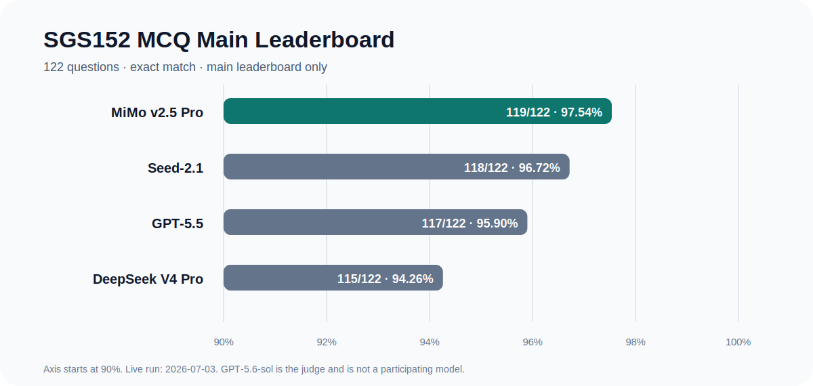

# Semiconductor Gas-Sensing Benchmark

SGS152 是面向半导体气敏材料研发的专业推理 benchmark，覆盖文献与机理判断、实验设计、数据质量、安全边界和研发决策。当前发布版本为 **v0.6.0**。

## 发布边界

| 层级 | 规模 | 发布用途 |
|---|---:|---|
| SGS152 MCQ | 122 | 唯一主排行榜 |
| SGS152 free-response | 30 | 单独报告，不并入主榜 |
| Robustness | 40 | 可选一致性诊断 |
| Hard50 | 50 | 已饱和的 regression diagnostic |

GPT-5.6-sol 仅作为固定 rubric 的 **Judge**，不是参赛模型，也不产生参赛成绩。参赛模型为 GPT-5.5、Seed-2.1、DeepSeek V4 Pro 和 MiMo v2.5 Pro。

## 主排行榜



| Model | SGS152 MCQ | Accuracy |
|---|---:|---:|
| MiMo v2.5 Pro | 119 / 122 | 97.54% |
| Seed-2.1 | 118 / 122 | 96.72% |
| GPT-5.5 | 117 / 122 | 95.90% |
| DeepSeek V4 Pro | 115 / 122 | 94.26% |

主集分数高度饱和，模型差异由少量题目决定。v0.6.0 的选项审计发现 56 个可辩护的非 Gold 选项，因此 exact-match 结果必须与审计记录共同解释。

## Free-response 复核结果

每条回答按 8 个维度计分，总分 10 分。自动 Judge 的 Hard Fail 仅为 provisional；只有复核确认的 Hard Fail 才影响官方分数。

```text
if no_answer:
    official_item_score = 0
elif confirmed_hard_fail:
    official_item_score = 0
else:
    official_item_score = reviewed_dimension_total
```

| Model | Reviewed average | Official average |
|---|---:|---:|
| GPT-5.5 | 8.213 | 8.213 |
| Seed-2.1 | 7.545 | 7.545 |
| DeepSeek V4 Pro | 6.732 | 6.732 |
| MiMo v2.5 Pro | 5.257 | 4.952 |

15 个历史 Hard Fail 经专家 X 逐条审核后，3 个确认为 Hard Fail，12 个降级为普通维度问题。确认项为 MiMo `SGS-082`、`SGS-FM-FR-007`、`SGS-FM-FR-011`。DeepSeek `SGS-081` 是原始缺答，继续按 no-rescue 规则计 0。

## v0.6.0 审计覆盖

- 242/242 条主集与诊断集题目有效性记录；
- 122 个 MCQ 题组、488/488 个选项记录；
- 30 个 Reference Answer、112/112 个 claim-level 证据记录；
- 120/120 条 free-response 逐题复核、960/960 条维度评分；
- 40/40 条 Robustness pair review；
- 50/50 条 Hard50 calibration；
- 原始证据 ZIP 46 个成员及每个成员 SHA-256；
- raw-to-derived 逐字段重建差异为 0。

本轮没有修改题干、选项、Gold Answer、Reference Answer、题目 ID 或原始模型输出。5 个冻结 P0 和其他问题通过审计文件、Known Limitations 与未来修改队列披露。

## 关键文件

- 题库：[`data/benchmark.json`](data/benchmark.json)
- v0.6.0 评审：[`review/v0.6.0/`](review/v0.6.0/)
- 已知限制：[`review/v0.6.0/00_scope/known_limitations.md`](review/v0.6.0/00_scope/known_limitations.md)
- 评分协议：[`docs/scoring_protocol.md`](docs/scoring_protocol.md)
- 数据集说明：[`docs/dataset_card.md`](docs/dataset_card.md)
- 可复现性：[`docs/reproducibility.md`](docs/reproducibility.md)
- 评测报告：[`reports/evaluation_report.md`](reports/evaluation_report.md)
- v0.6.0 Release Notes：[`RELEASE_NOTES.md`](RELEASE_NOTES.md)

## 验证

```bash
make validate
make lint
make lint-sgs100
make validate-hard50
python3 scripts/final_provenance_audit.py
python3 scripts/audit_v0_6.py
```

完整 raw rebuild 命令见 [`docs/reproducibility.md`](docs/reproducibility.md)。
