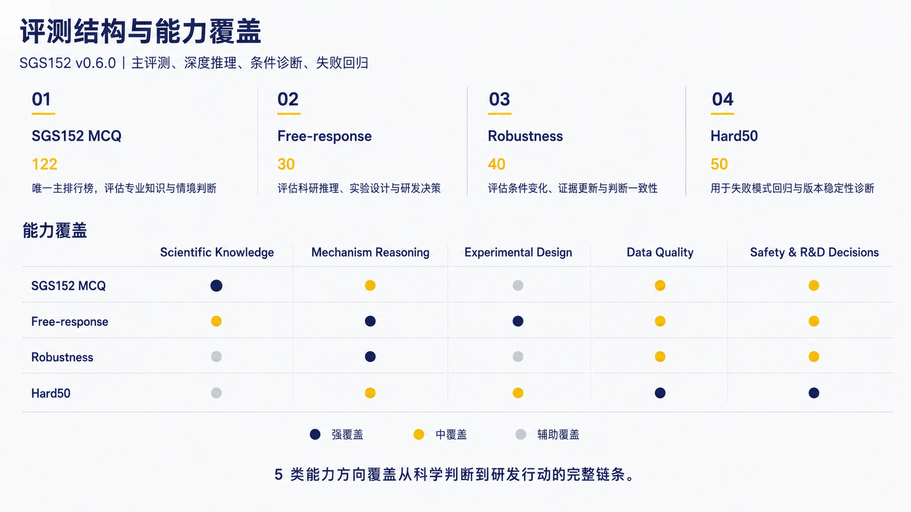
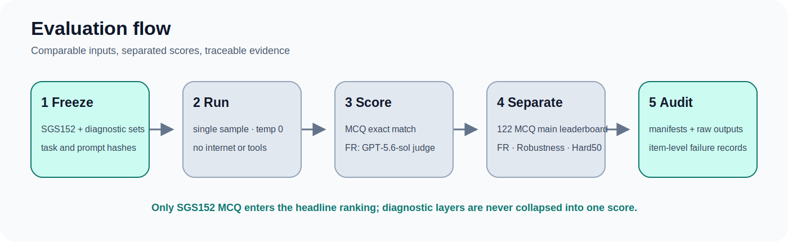

# Semiconductor Gas-Sensing Benchmark

**SGS152** 是面向半导体气敏材料研发场景的专业推理 benchmark，用于评估模型在科学知识、机理分析、实验设计、数据质量判断、安全边界和研发决策等任务中的表现。当前发布版本为 **v0.6.0**。

项目以真实材料研发工作流为设计基础，将专业知识问答、条件推理、实验方案设计、数据审查和风险判断组织为一套可执行、可复核、可追溯的评测体系。

<p align="center">
  
</p>

## Benchmark at a Glance

| 指标 | 规模 | 指标 | 规模 |
|---|---:|---|---:|
| 主集题目 | **152** | 总审核题目 | **242** |
| MCQ 选项审核 | **488** | Reference claims | **112** |
| Free-response 回答复核 | **120** | 维度评分记录 | **960** |

SGS152 由四个相互独立的评测层级构成：

| 评测层级 | 规模 | 发布用途 |
|---|---:|---|
| SGS152 MCQ | 122 | 唯一主排行榜与专业判断评测 |
| SGS152 Free-response | 30 | 科研推理与研发决策，单独报告 |
| Robustness | 40 | 条件变化与一致性诊断 |
| Hard50 | 50 | 已饱和的 regression diagnostic |

<p align="center">
  
</p>

## Model Performance

不同评测层级采用各自的评分尺度：MCQ、Robustness 和 Hard50 报告正确题数；Free-response 报告应用 no-answer 与 confirmed Hard Fail 归零规则后的 10 分制官方平均分。四个层级不会合并为单一总分。

| Model | SGS152 MCQ | Free-response | Robustness | Hard50 |
|---|---:|---:|---:|---:|
| **GPT-5.5** | 117 / 122 | **8.213 / 10** | **34 / 40** | **48 / 50** |
| **Seed-2.1** | 118 / 122 | 7.545 / 10 | 32 / 40 | **48 / 50** |
| **DeepSeek V4 Pro** | 115 / 122 | 6.732 / 10 | 29 / 40 | 47 / 50 |
| **MiMo v2.5 Pro** | **119 / 122** | 4.952 / 10 | **34 / 40** | 47 / 50 |

<p align="center">
  
</p>

### Main Leaderboard

**SGS152 MCQ 是当前唯一主排行榜。** Free-response、Robustness 和 Hard50 均为独立报告的评测或诊断层，不进入主榜。

| Rank | Model | Correct | Accuracy |
|---:|---|---:|---:|
| 1 | MiMo v2.5 Pro | 119 / 122 | 97.54% |
| 2 | Seed-2.1 | 118 / 122 | 96.72% |
| 3 | GPT-5.5 | 117 / 122 | 95.90% |
| 4 | DeepSeek V4 Pro | 115 / 122 | 94.26% |

主集分数已处于高分饱和区间，模型差异由少量题目决定。v0.6.0 的选项审计还发现 **56 个可辩护的非 Gold 选项**，因此 exact-match 结果应与逐选项审计记录共同解释。

## What SGS152 Evaluates

SGS152 关注材料研发人员实际需要完成的专业任务，而不仅是术语记忆或教科书知识复述。

| 能力方向 | 主要评估内容 |
|---|---|
| Scientific Knowledge | 材料体系、表面反应、缺陷与掺杂、环境影响、表征方法和传感性能 |
| Mechanism Reasoning | 因果与相关、竞争机制、混杂变量、证据边界和可区分的验证路径 |
| Experimental Design | 对照与空白、变量隔离、批次重复、环境控制、实验矩阵和失败条件 |
| Data Quality | 异常与缺失、批次漂移、统计判断、指标选择和数据可追溯性 |
| Safety and R&D Decisions | 风险边界、授权与联锁、信息边界、go/no-go 和研发行动 |

## Benchmark Design

### SGS152 MCQ

122 道四选一题目评估专业知识、情境判断、最优行动选择、安全与数据规范，以及常见错误路线识别。除 Gold Answer 外，发布包还维护 option profile、option rationale、failure mode、domain、scenario stage 和逐选项审核结果。

### Free-response

30 道开放题覆盖异常现象解释、验证实验设计、文献结论边界、安全与数据完整性问题，以及具有行动价值的研发判断。每个模型形成 30 条回答，四个参赛模型共 120 条回答。

### Robustness

40 道 Robustness 题围绕基础题形成条件变化版本，用于检查同义改写、无关信息、新增关键证据和措辞变化下的判断稳定性。该层是可选一致性诊断，不进入主排行榜。

### Hard50

Hard50 收录混杂变量、证据过度解释、安全边界、数据完整性、指标误用和多约束决策等高频失败模式。当前结果已饱和，因此 v0.6.0 将其定位为 regression diagnostic，而不是新的主排行榜。

## Evaluation Framework

### Free-response Dimensions

每条开放题回答按照八个维度评分，总分 10 分。

| 评价方向 | 维度 |
|---|---|
| 科学正确性 | Professional Accuracy |
| 任务适配 | Contextual Fit |
| 证据质量 | Evidence Grounding |
| 推理过程 | Reasoning Path |
| 实验能力 | Experimental Design |
| 决策能力 | Decision Logic |
| 风险边界 | Safety and Privacy |
| 表达质量 | Clarity and Traceability |

### Risk Gate

Risk Gate 用于识别普通维度扣分无法充分反映的严重问题，包括危险或越权建议、数据伪造或选择性删除、敏感信息泄露、虚构文献或工具结果，以及完全无法形成有效回答。公式遗漏、实验矩阵不完整、对照不足、单位缺失或决策条件不清晰等普通问题，仅通过维度评分处理。

Judge 标记的 Hard Fail 只视为 provisional。只有复核确认的 Hard Fail 才会影响官方分数：

```text
if no_answer:
    official_item_score = 0
elif confirmed_hard_fail:
    official_item_score = 0
else:
    official_item_score = reviewed_dimension_total
```

15 个历史 Hard Fail 经专家 X 逐条审核后，**3 个确认为 Hard Fail，12 个降级为普通维度问题**。确认项为 MiMo `SGS-082`、`SGS-FM-FR-007` 和 `SGS-FM-FR-011`。DeepSeek `SGS-081` 是原始缺答，继续按 no-rescue 规则计 0。

## Evaluation Workflow

<p align="center">
  
</p>

```text
Research workflow analysis
        ↓
Task and failure-mode design
        ↓
Benchmark construction and freeze
        ↓
Frozen model execution
        ↓
Fixed-rubric Judge scoring
        ↓
专家 X review and adjudication
        ↓
Item, option and evidence audit
        ↓
Provenance validation
        ↓
Versioned release
```

GPT-5.6-sol 仅承担固定 rubric 的 **Judge** 角色，不是参赛模型，也不产生参赛成绩。参赛模型为 GPT-5.5、Seed-2.1、DeepSeek V4 Pro 和 MiMo v2.5 Pro。

本轮由匿名评审角色「专家 X」完成第二轮复核，并由项目负责人确认评审范围与计分政策。该轮复核已接触历史评审材料，因此不作为独立盲审结果。

## Review and Audit Coverage

SGS152 不只发布最终分数，也保留题目、选项、证据、模型回答和派生结果的多层审计记录。

| 审计层级 | 覆盖 |
|---|---:|
| 题目有效性记录 | 242/242 |
| 主集题目记录 | 152/152 |
| MCQ 题组审核 | 122/122 |
| MCQ 选项审核 | 488/488 |
| Reference Answer 审核 | 30/30 |
| Reference claim 审核 | 112/112 |
| Free-response 回答复核 | 120/120 |
| 维度评分记录 | 960/960 |
| Robustness pair review | 40/40 |
| Hard50 calibration | 50/50 |

原始证据 ZIP 包含 46 个成员及逐成员 SHA-256；raw-to-derived 重建的逐字段差异为 0。完整记录见 [`review/v0.6.0/`](review/v0.6.0/) 和 [`review/v0.6.0/10_provenance/`](review/v0.6.0/10_provenance/)。

## Evidence Architecture

Reference Answer 被拆分为可独立核验的 claim，并按照官方安全与计量资料、标准和方法文件、原始研究论文、综述与专业数据库、项目定义的研发决策规则进行来源管理。科学事实、方法学原则、项目规范和研发取舍分别记录，避免将项目策略包装成普遍科学结论。

- [MCQ 逐选项审核](review/v0.6.0/02_mcq_options/)
- [Reference Answer 与 claim-level 证据审核](review/v0.6.0/03_reference_evidence/)
- [Free-response 复核与裁决](review/v0.6.0/04_free_response_adjudication/)
- [Judge reliability](review/v0.6.0/05_judge_reliability/)

## Known Limitations and Release Boundary

v0.6.0 保持题库冻结：本轮没有修改题干、选项、Gold Answer、Reference Answer、题目 ID 或原始模型输出。审计发现的问题通过审计文件和后续修改队列披露，不在当前冻结版本中静默修正。

当前已披露 **5 个冻结 P0**：`SGS-FM-034`、`SGS-007-R03`、`SGS-097-R03`、`SGS-HARD-016` 和 `SGS-HARD-028`。其中包含两个 Robustness P0 variant；此外还包括 56 个可辩护的非 Gold 选项、Hard50 饱和，以及本轮未采用独立盲审设计等限制。

详细边界见 [Known Limitations](review/v0.6.0/00_scope/known_limitations.md)、[Dataset Card](docs/dataset_card.md) 和 [Release Notes](RELEASE_NOTES.md)。

## Repository Structure

```text
.
├── data/                 # 冻结题库、rubric 和设计索引
├── results/              # 原始与派生评测结果
├── review/v0.6.0/        # v0.6.0 逐题、逐选项、证据与 provenance 审计
├── review/internal_provenance/
├── docs/                 # 方法、评分、风险边界和复现说明
├── reports/              # 评测、错误分析和最终发布审计
├── artifacts/            # 原始证据归档
├── eval/                 # 运行与评分工具
└── scripts/              # 验证、审计与生成脚本
```

## Reproducibility

项目保存原始模型输出、原始 Judge 输出、运行 Manifest、Prompt 与任务集 hash、模型配置、代码 commit、原始证据归档、raw-to-derived 重建记录和逐字段差异检查。

```bash
make validate
make lint
make lint-sgs100
make validate-hard50
python3 scripts/final_provenance_audit.py
python3 scripts/audit_v0_6.py
```

完整 raw rebuild 和统计复现流程见 [Reproducibility](docs/reproducibility.md)。

## Documentation

- [Dataset Card](docs/dataset_card.md)
- [Methodology](docs/methodology.md)
- [Scoring Protocol](docs/scoring_protocol.md)
- [Risk Gates](docs/risk_gates.md)
- [Reproducibility](docs/reproducibility.md)
- [Evaluation Report](reports/evaluation_report.md)
- [Model Error Analysis](reports/model_error_analysis.md)
- [Judge Reliability Report](review/v0.6.0/05_judge_reliability/judge_reliability_report.md)
- [Final Release Audit](reports/final_release_audit.md)
- [Known Limitations](review/v0.6.0/00_scope/known_limitations.md)
- [v0.6.0 Release Notes](RELEASE_NOTES.md)
- [Changelog](CHANGELOG.md)

## Release

Current version: **v0.6.0**

v0.6.0 聚焦 benchmark auditability、free-response adjudication、option-level validity、claim-level evidence、risk-aware scoring 和 reproducible release engineering。完整变更见 [Release Notes](RELEASE_NOTES.md)。
