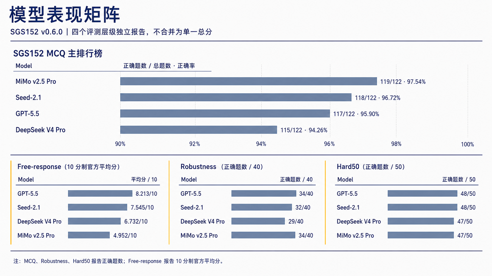

# SGS152：半导体气敏材料研发推理基准

SGS152 是面向半导体气敏材料研发场景的专业推理 benchmark，用于评估模型在科学知识、机理分析、实验设计、数据质量、安全边界和研发决策等任务中的表现。当前发布版本为 **v0.6.0**。

<p align="center">
  
</p>

## 项目概览

SGS152 以真实材料研发工作流为设计基础，将专业知识问答、条件推理、实验方案设计、数据审查和风险判断组织为四个独立评测层级。

| 评测层级 | 规模 | 主要用途 |
|---|---:|---|
| SGS152 MCQ | 122 | 唯一主排行榜，评估专业知识与情境判断 |
| Free-response | 30 | 评估科研推理、实验设计与研发决策 |
| Robustness | 40 | 诊断条件变化、证据更新与判断一致性 |
| Hard50 | 50 | 回归高频失败模式与版本稳定性 |

主集共 152 道任务，由 122 道 MCQ 和 30 道 Free-response 组成。Robustness 与 Hard50 作为独立诊断集报告，不与主集成绩合并为单一总分。

## 模型表现

MCQ、Robustness 和 Hard50 报告正确题数；Free-response 报告应用正式计分规则后的 10 分制官方平均分。四个参评模型使用相同的展示格式。

| Model | SGS152 MCQ | Free-response | Robustness | Hard50 |
|---|---:|---:|---:|---:|
| GPT-5.5 | 117 / 122 | 8.213 / 10 | 34 / 40 | 48 / 50 |
| Seed-2.1 | 118 / 122 | 7.545 / 10 | 32 / 40 | 48 / 50 |
| DeepSeek V4 Pro | 115 / 122 | 6.732 / 10 | 29 / 40 | 47 / 50 |
| MiMo v2.5 Pro | 119 / 122 | 4.952 / 10 | 34 / 40 | 47 / 50 |

<p align="center">
  
</p>

### 主排行榜

SGS152 MCQ 是当前唯一主排行榜。Free-response、Robustness 和 Hard50 均独立报告，不进入主榜。

| Rank | Model | Correct | Accuracy |
|---:|---|---:|---:|
| 1 | MiMo v2.5 Pro | 119 / 122 | 97.54% |
| 2 | Seed-2.1 | 118 / 122 | 96.72% |
| 3 | GPT-5.5 | 117 / 122 | 95.90% |
| 4 | DeepSeek V4 Pro | 115 / 122 | 94.26% |

主集已进入高分区间，模型差异主要集中在少量复杂情境判断题。SGS152 因此同时报告 Free-response、Robustness 与 Hard50，用于补充 exact-match 主榜难以展现的推理质量、行动能力与条件稳定性。

## 四层评测设计

### SGS152 MCQ

122 道四选一题目覆盖专业知识、情境判断、最优行动选择、安全与数据规范，以及常见错误路线识别。题库同时维护 option profile、option rationale、failure mode、domain 和 scenario stage 等结构化信息。

### Free-response

30 道开放题要求模型解释异常现象、设计验证实验、判断文献结论边界、处理安全与数据完整性问题，并给出具有行动价值的研发判断。

### Robustness

40 道条件变化题用于检查模型能否在同义改写、无关信息、新增关键证据和措辞变化下保持或合理更新判断。

### Hard50

50 道失败模式回归题聚焦混杂变量、证据过度解释、安全边界、数据完整性、指标误用和多约束决策，用于版本稳定性诊断。

## 专业能力覆盖

| 能力方向 | 主要评估内容 |
|---|---|
| Scientific Knowledge | 材料体系、表面反应、缺陷与掺杂、环境影响、表征方法和传感性能 |
| Mechanism Reasoning | 因果与相关、竞争机制、混杂变量、证据边界和验证路径 |
| Experimental Design | 对照与空白、变量隔离、批次重复、环境控制和实验矩阵 |
| Data Quality | 异常与缺失、批次漂移、统计判断、指标选择和数据可追溯性 |
| Safety and R&D Decisions | 风险边界、授权与联锁、信息边界、go/no-go 和研发行动 |

## 开放题评价框架

每条 Free-response 回答按照八个维度评分，总分 10 分。

| 评价方向 | 维度 |
|---|---|
| 科学正确性 | Professional Accuracy |
| 任务适配 | Contextual Fit |
| 证据质量 | Evidence Grounding |
| 推理过程 | Reasoning Path |
| 实验能力 | Experimental Design |
| 决策能力 | Decision Logic |
| 风险边界 | Safety and Privacy |
| 表达质量 | Clarity and Traceability |

Risk Gate 与普通维度评分分开处理。经复核确认的安全、数据完整性、隐私或证据真实性问题，会将对应条目的官方分数记为 0；其他问题通过八维评分反映。具体规则与案例见 [Scoring Protocol](docs/scoring_protocol.md)、[Risk Gates](docs/risk_gates.md) 和 [Evaluation Report](reports/evaluation_report.md)。

## 审核覆盖与可复现性

SGS152 保留题目、选项、Reference claim、模型回答、评分和原始证据的版本化审核记录。

| 审核层级 | 覆盖 |
|---|---:|
| 题目有效性记录 | 242/242 |
| 主集题目记录 | 152/152 |
| MCQ 题组审核 | 122/122 |
| MCQ 选项审核 | 488/488 |
| Reference Answer 审核 | 30/30 |
| Reference claim 审核 | 112/112 |
| Free-response 回答复核 | 120/120 |
| 维度评分记录 | 960/960 |
| Robustness pair review | 40/40 |
| Hard50 calibration | 50/50 |

GPT-5.6-sol 仅承担固定 rubric 的 Judge 角色，不是参评模型，也不产生参评成绩。本轮由匿名评审角色「专家 X」完成专业复核，并由项目负责人确认评审范围、计分政策与发布口径。

项目保存原始模型输出、Judge 输出、运行 Manifest、Prompt 与任务集 hash、模型配置、代码 commit、原始证据归档和 raw-to-derived 重建记录。完整复现流程见 [Reproducibility](docs/reproducibility.md)。

```bash
make validate
make lint
make lint-sgs100
make validate-hard50
python3 scripts/final_provenance_audit.py
python3 scripts/audit_v0_6.py
```

## 文档导航

- [Dataset Card](docs/dataset_card.md)
- [Methodology](docs/methodology.md)
- [Scoring Protocol](docs/scoring_protocol.md)
- [Risk Gates](docs/risk_gates.md)
- [Reproducibility](docs/reproducibility.md)
- [Evaluation Report](reports/evaluation_report.md)
- [Model Error Analysis](reports/model_error_analysis.md)
- [Judge Reliability Report](review/v0.6.0/05_judge_reliability/judge_reliability_report.md)
- [Final Release Audit](reports/final_release_audit.md)
- [MCQ 逐选项审核](review/v0.6.0/02_mcq_options/)
- [Reference claim 证据审核](review/v0.6.0/03_reference_evidence/)
- [Known Limitations](review/v0.6.0/00_scope/known_limitations.md)
- [v0.6.0 Release Notes](RELEASE_NOTES.md)
- [Changelog](CHANGELOG.md)

## 发布与审计说明

v0.6.0 保留冻结题库与历史运行结果。题目、选项和证据审核中发现的争议项均通过版本化记录保存，并纳入后续修订队列。

v0.6.0 完成了开放题评分体系、逐选项审核、Reference claim 证据管理、风险评分和原始结果复现流程的版本化整合。
